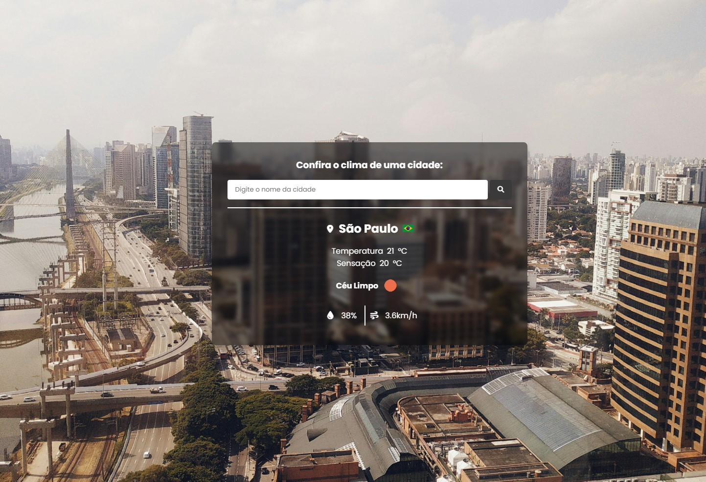

# 🌦️ Weather Visual — Previsão do Tempo com Imagens Dinâmicas

Um aplicativo web simples que exibe as condições climáticas atuais de uma cidade e insere automaticamente uma imagem de fundo relacionada à cidade pesquisada, tornando a experiência mais visual.



---

## 📌 Funcionalidades

- Busca por qualquer cidade do mundo
- Retorna:
  - Temperatura atual
  - Sensação térmica
  - Descrição do clima (ex: "céu limpo", "chuva leve")
  - Umidade
  - Velocidade do vento
  - Bandeira do país
  - Ícone do clima atual
- Insere automaticamente uma imagem da cidade como plano de fundo, via API do Unsplash
- Tratamento de erros para cidade inválida ou não encontrada
- Interface leve e responsiva

---

## 🚀 Tecnologias Utilizadas

- **HTML** + **CSS** (estrutura e estilo)
- **JavaScript Vanilla** (sem frameworks)
- [OpenWeatherMap API](https://openweathermap.org/api) — clima em tempo real
- [Unsplash API](https://unsplash.com/developers) — imagens de fundo
- [FlagsAPI](https://flagsapi.com) — bandeiras dos países

---

## 🔗 Link para testar o projeto
- [Clique aqui para testar](https://weather-api-neon-six.vercel.app/)

## 🧪 Como usar

1. **Clone o repositório:**

```bash
git clone https://github.com/seu-usuario/weather-visual.git
cd weather-visual
